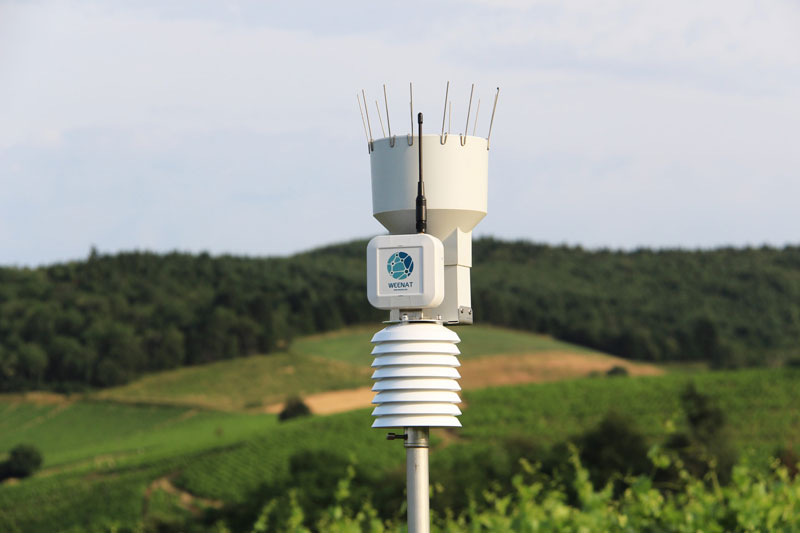
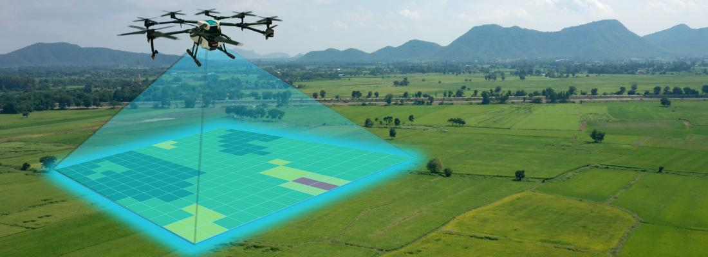
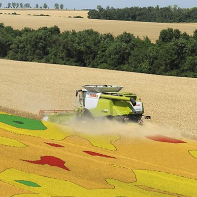
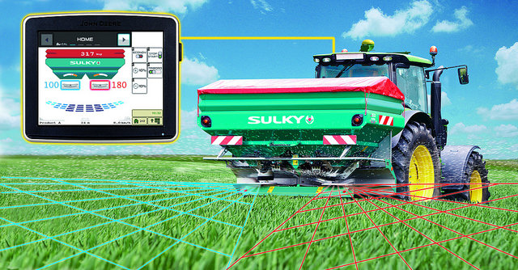

```{r setup, include=FALSE}
knitr::opts_chunk$set(echo = TRUE)
```

Introduction :

---
title: "L'Évolution de l'Agriculture de Précision : L'Influence Déterminante du Numérique dans le Secteur Agricole"
---

En qualité d'étudiant de l’Isara, il convient d'explorer l'impact substantiel de la révolution numérique sur l'agriculture contemporaine, en particulier dans le contexte de l'évolution de l'agriculture de précision. Cette discipline intègre les dernières avancées technologiques pour optimiser l'efficacité opérationnelle et maximiser la durabilité des exploitations. Nous allons donc voir comment les technologies numériques, notamment les capteurs, les drones, les systèmes de positionnement global (GPS), et les algorithmes informatiques, convergent pour redéfinir le paysage agricole. À travers une analyse détaillée, nous chercherons à comprendre comment l'agriculture de précision s'est adaptée, évoluée et a influencé les pratiques agricoles contemporaines, offrant ainsi une perspective éclairée sur le futur de l'agriculture moderne.

## Les Capteurs : Les Yeux et les Oreilles :

Au cœur de la transformation numérique de l'agriculture de précision se trouvent les capteurs, devenus les yeux et les oreilles infaillibles des agriculteurs modernes. Ces dispositifs sophistiqués sont déployés au sein des champs pour mesurer une pléthore de paramètres cruciaux, allant de la qualité du sol à la santé des cultures. Les capteurs de sol, par exemple, fournissent des données en temps réel sur la composition chimique et la structure du sol, permettant ainsi aux agriculteurs d'ajuster précisément les niveaux d'engrais et d'optimiser la croissance des plantes.

Les capteurs atmosphériques ne sont pas en reste, offrant des informations précieuses sur les conditions météorologiques locales. La température, l'humidité, et la pression atmosphérique sont mesurées avec une précision remarquable, fournissant des données cruciales pour anticiper les changements climatiques et adapter les pratiques agricoles en conséquence. Ces observations en temps réel permettent une prise de décision rapide et informée, minimisant les risques liés aux variations climatiques.


<div style="text-align:center">

<p style="font-size:18px; font-weight:bold;">Capteur météo de l'entreprise Weenat</p>
</div>


## Les Drones : Perspectives Aériennes sans Précédent


À la suite de l'éclairage apporté par les capteurs, élargissons notre regard vers le ciel, où les drones se trouvent être de grands atouts pour l'agriculture de précision. Ces aéronefs télécommandés ont révolutionné la collecte de données en fournissant une perspective aérienne sans précédent sur les champs agricoles.

Les drones équipés de capteurs multispectraux capturent des images détaillées, révélant des informations cruciales sur la santé des cultures. Des variations subtiles de couleur peuvent indiquer des zones de stress ou des signes précurseurs de maladies, permettant ainsi une intervention précoce et ciblée. En survolant les champs avec agilité, les drones contribuent également à cartographier la topographie du terrain, identifiant les zones nécessitant une attention particulière.

Outre la surveillance, les drones ont également des applications pratiques, notamment la pulvérisation de précision. Grâce à leur capacité à atteindre des zones difficiles d'accès, ils permettent une distribution précise d'engrais ou de pesticides, réduisant ainsi les quantités nécessaires et minimisant l'impact environnemental.


<div style="text-align:center">

<p style="font-size:18px; font-weight:bold;">Drone agricole cartographiant le terrain</p>
</div>


## Les Satellites : Une Vision Panoramique depuis l'Espace


Alors que les capteurs et les drones nous ancrent dans la proximité terrestre, les satellites nous offrent une vision panoramique depuis l'espace. En fusionnant ces différentes perspectives, l'agriculture de précision devient un véritable ballet technologique, où chaque acteur joue un rôle clé dans l'optimisation des pratiques agricoles. Continuons notre exploration, en analysant comment ces technologies convergent pour redéfinir les normes de l'agriculture moderne.

L'imagerie satellite fournit une vision d'ensemble inégalée, permettant aux agriculteurs de surveiller l'évolution des cultures sur de vastes étendues. Les données multispectrales capturées par ces engins spatiaux permettent de détecter des tendances à long terme, d'identifier les zones à haut rendement et d'évaluer l'impact des conditions météorologiques sur l'ensemble des exploitations.

Les avantages des satellites s'étendent au-delà de la simple observation. Ils facilitent la création de cartes de rendement, aidant ainsi les agriculteurs à ajuster leurs pratiques en fonction de la variabilité spatiale des cultures. De plus, les images satellitaires régulières contribuent à évaluer la santé des cultures et à anticiper les besoins futurs en ressources.

## Les Tracteurs Connectés et les Outils Intelligents : 

Au sein du panorama technologique de l'agriculture de précision, les tracteurs connectés et les outils intelligents émergent en tant qu'artisans technologiques. Ces engins agricoles, bien au-delà de leurs rôles traditionnels, se transforment en plates-formes intelligentes, orchestrant des opérations complexes avec une efficacité inégalée.

Les tracteurs connectés, dotés de systèmes GPS sophistiqués, ne se contentent plus de labourer les champs. Grâce à des capteurs intégrés, ces machines peuvent surveiller en temps réel des paramètres tels que la profondeur de labour, l'espacement des rangs et même la qualité du sol. Cette synchronisation fine garantit une utilisation optimale des ressources et une productivité maximale.

Autre exemple, les moissonneuses peuvent elles aussi être équipées de ces technologies comme les cartographies de rendement. Lors de la récolte, la moissonneuse arrive grâce à une carte dans son ordinateur de bord renseigner sur une carte le rendement mètre par mètre de chaque zone du champ. Ces cartes peuvent ensuite servir pour l’épandage d’engrais l’année suivante de manière bien plus précise.


<div style="text-align:center">

<p style="font-size:18px; font-weight:bold;">Moissoneuse avec cartographie de rendement en temps réel</p>
</div>


Parallèlement, les outils agricoles traditionnels subissent une transformation numérique. Des cultivateurs aux pulvérisateurs, ces outils sont désormais équipés de capteurs et de dispositifs de géolocalisation. Cela permet une application précise d'engrais, une pulvérisation ciblée de pesticides, et une gestion minutieuse des cultures, le tout orchestré par les tracteurs connectés.


<div style="text-align:center">

<p style="font-size:18px; font-weight:bold;">Epandeur avec modulation de rendement</p>
</div>


L'introduction de l'Internet des Objets (IoT) dans ces équipements crée un réseau collaboratif, où les données générées par chaque tracteur et outil sont partagées instantanément. Cette interconnectivité permet une coordination optimale des opérations, maximisant l'efficacité et réduisant les gaspillages.


## Conclusion : Vers une Agriculture Connectée et Éclairée

En parcourant les différentes dimensions de l'agriculture de précision, il est évident que cette transformation agricole repose sur une convergence soigneusement orchestrée de technologies numériques. Les capteurs, drones, satellites, tracteurs connectés, et outils intelligents fonctionnent de manière synchronisée pour optimiser les pratiques agricoles.

Ces avancées représentent bien plus qu'une simple modernisation des méthodes agricoles. Elles incarnent une transition vers une agriculture plus efficace, durable, et adaptée aux défis contemporains. L'utilisation stratégique des données, la coordination précise des opérations, et l'intégration intelligente des technologies reflètent l'évolution vers une approche plus connectée et éclairée de la gestion agricole.

L'agriculture de précision n'est pas simplement une perspective ; elle est déjà une réalité dans nos champs. Alors que ces progrès continuent de s'inscrire dans le paysage agricole, il est clair que cette révolution numérique redéfinit notre relation avec la terre et promet un avenir plus efficace et durable pour l'agriculture moderne.

